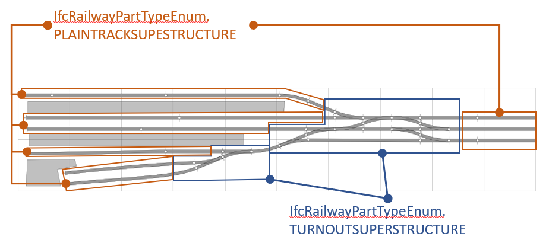

The IfcRailwayPartTypeEnum defines the range of different types of railway part that can be specified.

The Spatial structure of a Railway is sub-divided into several elements for lateral and vertical decomposition:

* TRACKSTRUCTURE is for the Track (vertical decomposition)
* SUPERSTRUCTURE is for the upper part of the railway (vertical decomposition)
* LINESIDESTRUCTURE is for the lateral part of the railway  (lateral decomposition)

Railway track structure have longitudinal decomposition based on track specificities:

* PLAINTRACKSUPESTRUCTURE for the plain line tracks (IfcElementAssemblyTypeEnum.TRACKPANEL).
* DILATATIONSUPERSTRUCTURE for the area of Dilatation panels (IfcElementAssemblyTypeEnum.DILATATIONPANEL).
* TURNOUTSUPERSTRUCTURE for the area of Turnouts (IfcElementAssemblyTypeEnum.TURNOUTPANEL).
* TRACKSTRUCTUREPART for generic longitudinal decomposition if needed.

More generic longitudinal subdivision is provided for Line side with LINESIDESTRUCTUREPART value if needed.

